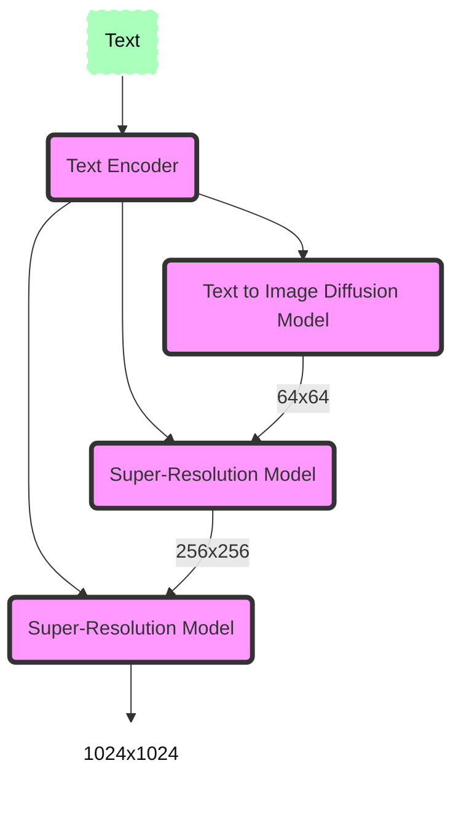

## drawnet Imagen - Pytorch (under construction)

Under construction Implementation of <a href="https://gweb-research-imagen.appspot.com/">Imagen</a>, Google's Text-to-Image Neural Network that beats DALL-E2, in Pytorch. It is the new SOTA for text-to-image synthesis.

TODO

- [x] T5-Encoder
- [x] Laion 400m downloader
- [x] Base Model (WIP)
- [ ] Data loader (WIP)
- [ ] Diffusion(DDIM) model
- [ ] Model Build
- [ ] Train Loop
- [ ] Structure
